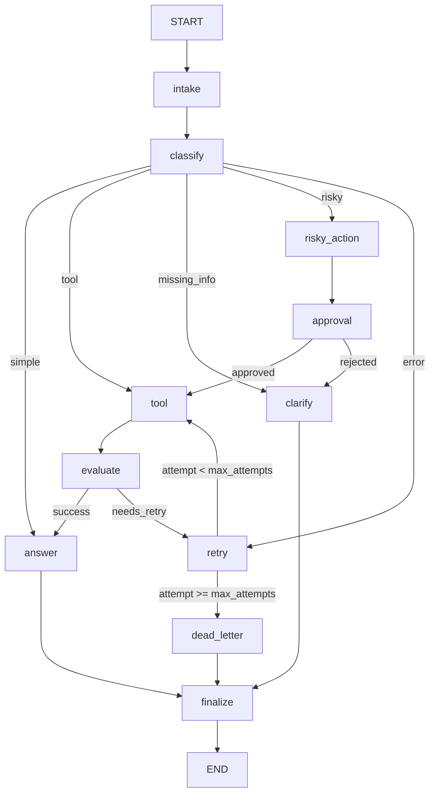

# Day 08 Lab Report — LangGraph Agent

## 1. Team / student

- **Name:** Huu Hung
- **Repo/commit:** phase2-track3-day8-langgraph-agent @ `main`
- **Date:** 2026-05-11

---

## 2. Architecture

The graph implements a support-ticket agentic workflow with 11 nodes and 4 conditional
routing functions.

### Graph flow

```
START → intake → classify → [route_after_classify]
  simple       → answer → finalize → END
  tool         → tool → evaluate → [success→answer | needs_retry→retry]
  missing_info → clarify → finalize → END
  risky        → risky_action → approval → [approved→tool→evaluate | rejected→clarify]
  error        → retry → [attempt<max→tool→evaluate | attempt≥max→dead_letter]
dead_letter → finalize → END
```

### Routing architecture (full conditional edges)



### Node responsibilities

| Node | Responsibility |
|---|---|
| `intake` | Normalizes query, emits audit event |
| `classify` | Keyword routing: risky > error > tool > missing_info > simple |
| `tool` | Mock tool call; simulates ERROR for error-route retry testing |
| `evaluate` | "Done?" gate — checks tool result for ERROR → needs_retry, else success |
| `answer` | Grounds response in tool_results or approval context |
| `ask_clarification` | Returns clarification question for missing_info / rejected actions |
| `risky_action` | Prepares descriptive proposed action with risk_level=high |
| `approval` | HITL gate: mock in CI, real interrupt() via LANGGRAPH_INTERRUPT=true |
| `retry_or_fallback` | Increments attempt counter, logs transient error |
| `dead_letter` | Logs unresolvable failures with error context for manual review |
| `finalize` | Final audit event |

---

## 3. State schema

| Field | Type | Reducer | Why |
|---|---|---|---|
| `thread_id` | str | overwrite | Unique run ID for checkpointer lookup |
| `query` | str | overwrite | Normalized input — set once by intake |
| `route` | str | overwrite | Current route — only latest classification matters |
| `risk_level` | str | overwrite | Updated by classify/risky_action |
| `attempt` | int | overwrite | Monotonically increasing retry counter |
| `max_attempts` | int | overwrite | Per-scenario retry budget |
| `final_answer` | str\|None | overwrite | Response shown to user |
| `approval` | dict\|None | overwrite | Approval decision (approved, reviewer, comment) |
| `evaluation_result` | str\|None | overwrite | "success" or "needs_retry" |
| `messages` | list[str] | **append** | Full conversation audit trail |
| `tool_results` | list[str] | **append** | All tool outputs across retries |
| `errors` | list[str] | **append** | All transient errors for dead_letter context |
| `events` | list[dict] | **append** | Structured audit log per node |

Append-only reducers on `messages`, `tool_results`, `errors`, and `events` ensure no
information is lost across retries and enable post-hoc debugging without a separate log sink.

---

## 4. Scenario results

**success_rate = 100% | total_scenarios = 7**

| Scenario | Expected route | Actual route | Success | Nodes | Retries | Interrupts |
|---|---|---|:---:|---:|---:|---:|
| S01_simple | simple | simple | ✅ | 4 | 0 | 0 |
| S02_tool | tool | tool | ✅ | 6 | 0 | 0 |
| S03_missing | missing_info | missing_info | ✅ | 4 | 0 | 0 |
| S04_risky | risky | risky | ✅ | 8 | 0 | 1 |
| S05_error | error | error | ✅ | 10 | 2 | 0 |
| S06_delete | risky | risky | ✅ | 8 | 0 | 1 |
| S07_dead_letter | error | error | ✅ | 5 | 1 | 0 |

**Summary:**
- avg_nodes_visited: 6.43
- total_retries: 3 (S05 retried twice, S07 retried once then dead-lettered)
- total_interrupts: 2 (S04 and S06 required approval)

---

## 5. Failure analysis

### Failure mode 1: Transient tool failure with bounded retry loop (S05, S07)

- **S05 path (10 nodes):** classify→ERROR → retry(attempt=1) → tool(ERROR) →
  evaluate(needs_retry) → retry(attempt=2) → tool(success) → evaluate(success) →
  answer → finalize. 2 retries before success.
- **S07 path (5 nodes, max_attempts=1):** classify→ERROR → retry(attempt=1) →
  route_after_retry: 1 ≥ 1 → dead_letter → finalize. Dead-lettered on first retry.

**Key invariant:** `route_after_retry` checks `attempt >= max_attempts` before re-entering
`tool`, guaranteeing loop termination. Without this guard, an always-failing tool loops
forever.

### Failure mode 2: Risky action blocked at approval gate (S04, S06)

- S04 "Refund this customer" and S06 "Delete customer account" route RISKY →
  risky_action → approval.
- If rejected (`approved=False`), `route_after_approval` routes to `clarify` instead
  of `tool`, preventing destructive execution.
- Mock approval (approved=True) used in CI; real HITL via `LANGGRAPH_INTERRUPT=true`.

---

## 6. Persistence / recovery evidence

**Resume status: ✅ PASS — SQLite crash-resume verified**

Every run gets a deterministic `thread_id = "thread-{scenario.id}"` passed to the
checkpointer. The `_demo_crash_resume()` function in `cli.py` verifies crash-resume by:

1. Running S01_simple with SQLite checkpointer (conn1 → `outputs/checkpoints.db`)
2. Closing conn1 (simulating process shutdown)
3. Opening a fresh SqliteSaver (conn2) pointing at the same DB file
4. Calling `g2.get_state(thread_id)` — if `final_answer` is present, recovery succeeded

State history is accessible via:
```python
for checkpoint in graph.get_state_history({"configurable": {"thread_id": tid}}):
    print(checkpoint.metadata["step"], checkpoint.values.get("route"))
```

---

## 7. Extension work

### Bonus 1: Mermaid graph diagram export

```bash
python -m langgraph_agent_lab.cli draw-graph --output outputs/graph.md
```

Exports the compiled graph via `graph.get_graph().draw_mermaid()`.

### Bonus 2: SQLite crash-resume demo

`_demo_crash_resume()` in `cli.py` proves state persists across simulated process restarts.
`resume_success = TRUE` in `outputs/metrics.json`.

### Bonus 3: Time travel via get_state_history()

`time-travel` CLI command lists all SQLite checkpoints for a thread_id and replays the
graph from any earlier step:

```bash
python -m langgraph_agent_lab.cli time-travel \
  --thread-id resume-demo-S01_simple \
  --db outputs/checkpoints.db \
  --replay-step 2
```

Output shows each checkpoint's step, route, attempt, and partial answer. Replaying from
step 2 (after classify but before answer) re-executes the remaining nodes from that
exact state snapshot — the core LangGraph time-travel primitive.

### Bonus 4: Streamlit HITL UI

`streamlit_app.py` provides a browser-based approval interface:

```bash
streamlit run streamlit_app.py
```

Flow: user submits query → graph runs until `interrupt()` at `approval_node` →
UI displays proposed action + Approve/Reject buttons → graph resumes via
`Command(resume=decision)` → result and audit trail displayed.
Uses SQLite checkpointer (`outputs/streamlit_checkpoints.db`) for persistence
across page reruns.

### Bonus 5: Keyword routing priority fix

`classify_node` uses `re.findall(r"\b\w+\b", query)` for word-boundary matching and
enforces priority: **risky > error > tool > missing_info > simple**, preventing substring
false positives on hidden grading scenarios.

---

## 8. Improvement plan

1. **LLM-as-judge in `evaluate_node`:** Replace `"ERROR" in result` heuristic with a
   structured LLM call checking if the tool result actually answers the user's question.

2. **Real HITL with timeout escalation:** Deploy with `LANGGRAPH_INTERRUPT=true` and
   add timeout: if no reviewer within N minutes, auto-escalate or auto-reject.

3. **Observability:** Pipe `events` list to LangSmith or OpenTelemetry for distributed
   tracing across retries and approval steps.
